# Udemy - Help Desk - Back-end com Spring

## Inicialização do Projeto
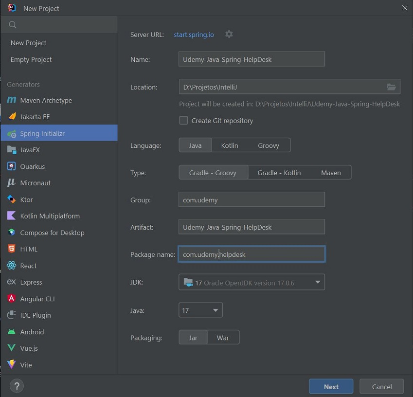

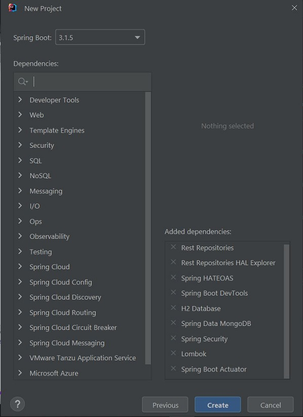


## MongoDB
- Baixar o MongoDB Community Server: https://www.mongodb.com/try/download/community
- Instalar o MongoDB Community Server com o MongoDB Compass.
- Executar o MongoDB Compass e conectar:

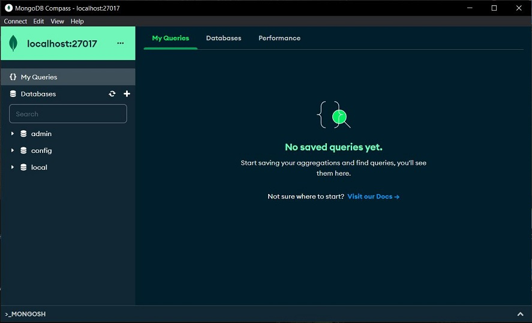


## Passos
1. Instalar JDK, IDE (IntelliJ) e MongoDB.
2. Criar projeto com as especificações exibidas anteriormente.
3. Adicionar o MongoDB ao projeto:
- Adicionar a dependência `implementation 'org.springframework.boot:spring-boot-starter-data-mongodb'` em `build.grade`.
- Configurar `application.properties`:
```properties
spring.data.mongodb.host=localhost
spring.data.mongodb.port=27017
spring.data.mongodb.database=local
```
4. Adicionar validador:
- Adicionar a dependência `implementation group: 'javax.validation', name: 'validation-api', version: '2.0.1.Final'` em `build.grade`.
5. Criar `ProfileEnum`, com 3 possíveis valores, e no pacote `api.enums`:

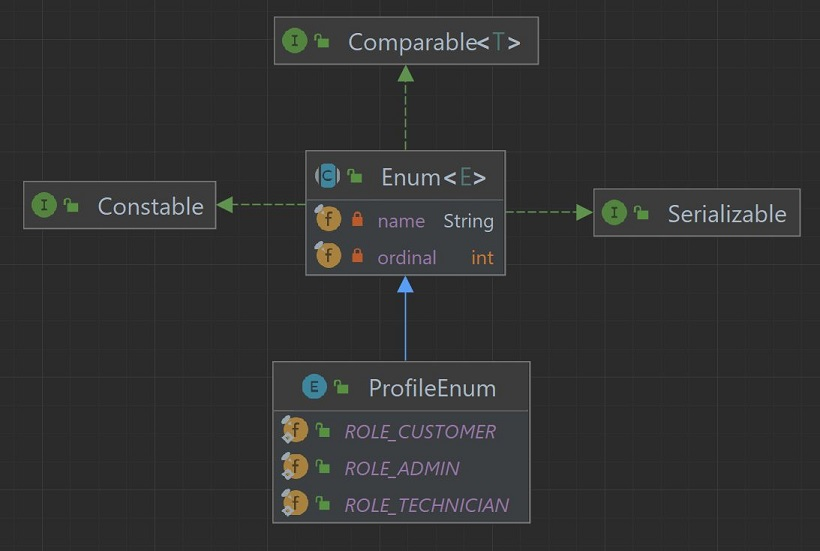

6. Adicionar classe User:
- com atributos `id`, `email`, `password` e `profile`;
- no pacote `api.entities`;
- anotada com `@Document` para o MongoDB;
- anotada com `@Data`, `@NoArgsConstructor`, `@AllArgsConstructor` para o Lombok.

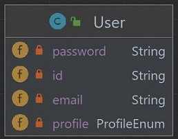

7. Criar `PriorityEnum`, com 3 possíveis valores, e no pacote `api.enums`:

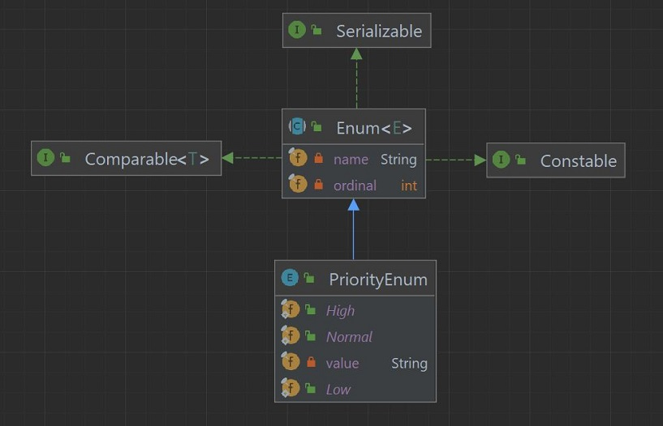

8. Criar `StatusEnum`, com 6 possíveis valores, e no pacote `api.enums`:

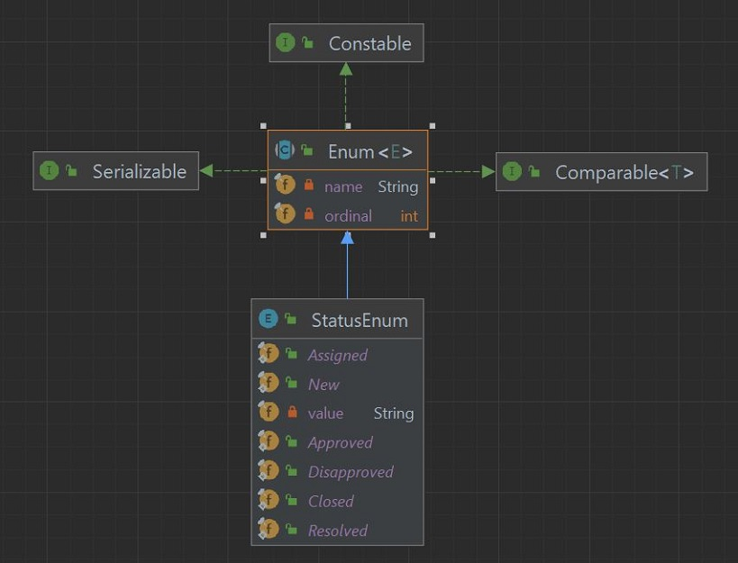

9. Adicionar classe `Ticket`:
- com atributos `user`, `assignedUser`, `date`, `title`, `number`, `status`, `priority`, `description`, `image`;
- no pacote `api.entities`;
- anotada com `@Document` para o MongoDB;
- anotada com `@Data`, `@NoArgsConstructor`, `@AllArgsConstructor` para o Lombok.

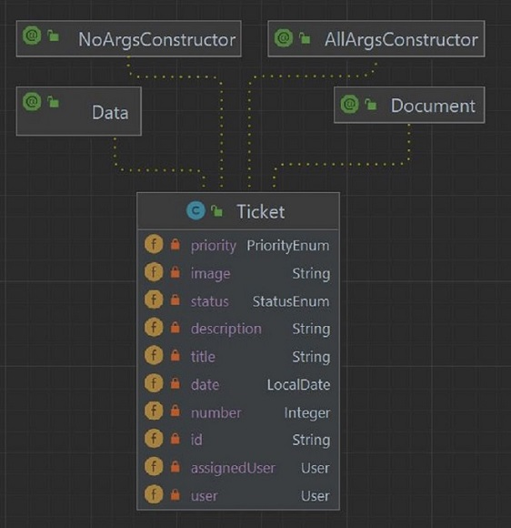

10. Adicionar classe `ChangeStatus`:
- com atributos `id`, `ticket`, `userChange`, `dateChangeStatus`, `status`;
- no pacote `api.entities`;
- anotada com `@Document` para o MongoDB;
- anotada com `@Data`, `@NoArgsConstructor`, `@AllArgsConstructor` para o Lombok.
- como atributo List na classe `Ticket` e anotada com `@Transient`.

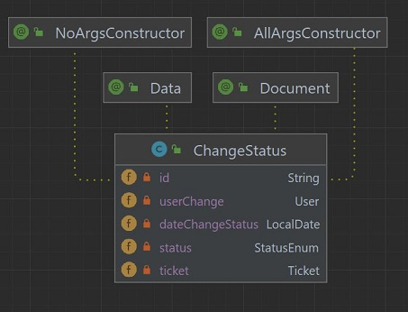

11. Criar interface `UserRepository`:
- no pacote `api.repositories`;
- extende `MongoRepository`;
- anotada com `@Repository`;
- com método `findByEmail`.

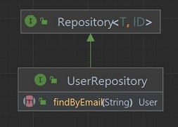

12. Criar interface `TicketRepository`:
- no pacote `api.repositories`;
- extende `MongoRepository`;
- anotada com `@Repository`;
- com métodos:
    * `findByUserIdOrderByDateDesc`;
    * `findByTitleIgnoreCaseContainingAndStatusAndPriorityOrderByDateDesc`;
    * `findByTitleIgnoreCaseContainingAndStatusAndPriorityAndUserIdOrderByDateDesc`;
    * `findByTitleIgnoreCaseContainingAndStatusAndPriorityAndAssignedUserIdOrderByDateDesc`;
    * `findByNumber`.

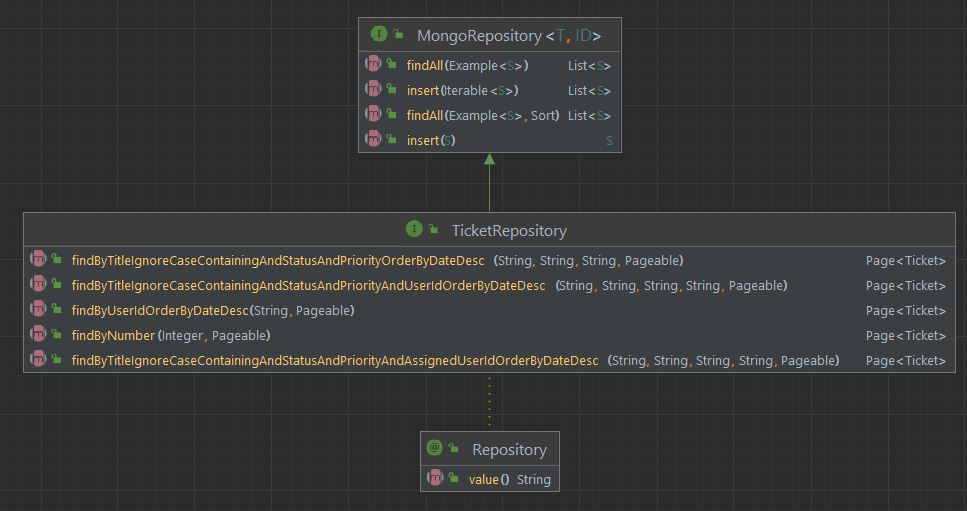

13. Criar interface `ChangeStatusRepository`:
- no pacote `api.repositories`;
- extende `MongoRepository`;
- anotada com `@Repository`;
- com método `findByTicketIdOrderByDateChangeStatusDesc`.

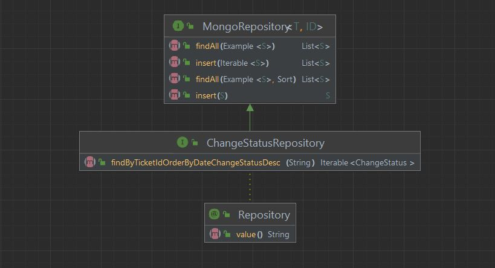

14. Adicionar interface `UserService` e classe `UserServiceImpl`:
- no pacote `api.services`
- com métodos `findByEmail`,`findById`,`createOrUpdate`,`delete`,`findAll`.

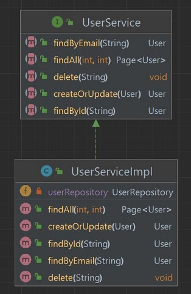

Obs.: Na autenticação stateless (não mantém estados), que não depende de sessão,
o jwt contém os dados de acesso do usuário que devem ser armazenados em algum lugar 
para serem compartilhados entre as requisições.

15. Adicionar requisitos do jwt para segurança da aplicação:
- dependência ao `build.gradle`:
```
implementation 'io.jsonwebtoken:jjwt-api:0.12.3'
runtimeOnly 'io.jsonwebtoken:jjwt-impl:0.12.3'
runtimeOnly 'io.jsonwebtoken:jjwt-jackson:0.12.3'
```
- configurações ao `application.properties`:
```properties
jwt.secret=helpDeskLeo
jwt.expiration=604800
```

16. Criar classe `JwtUser`:
- no pacote `api.security.jwt`;
- implementa `UserDetais`;
- com um atributo `static final long serialVersionUID = -7471177486146141709L`;
- com outros atributos `id`, `username`, `password`, `autorities`.

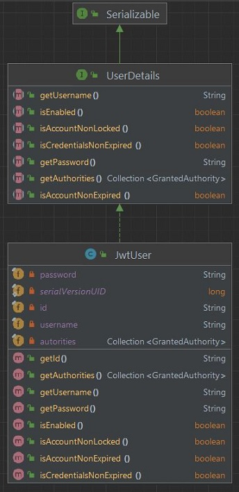

17. Criar classe `JwtUserFactory`:
- no pacote `api.security.jwt`;
- com método `static JwtUser create(User user)`;
- com método `static List<GrantedAuthority> mapToGrantedAuthorities(ProfileEnum profileEnum)`.

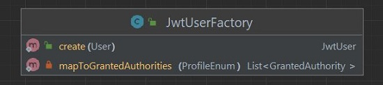

18. Criar classe `JwtTokenUtil`:
- implementa `Serializable`;
- com os atributos:
  * `private static final long serialVersionUID = 1L`;
  * `static final String CLAIM_KEY_USERNAME = "sub"`;
  * `static final String CLAIM_KEY_CREATED = "create"`;
  * `static final String CLAIM_KEY_EXPIRED = "exp"`;
  * `private String secret`;
  * `private Long expiration`;
- anotada com `@Component`.

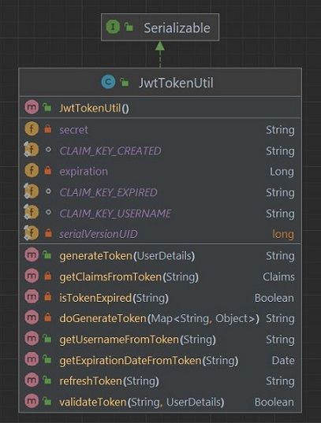

19. Criar classe `JwtUserDetailsServiceImpl`:
- implementa `UserDetailsService`;
- tem um atributo da classe `UserService`.

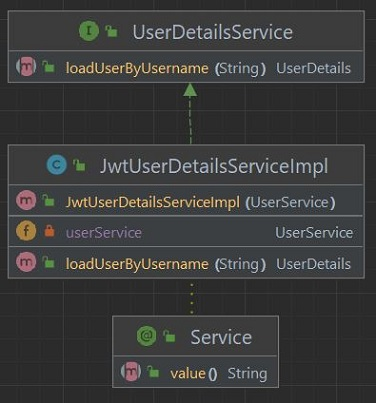

20. Criar classe `JwtAuthenticationEntryPoint`:
- implementa `AuthenticationEntryPoint` e `Serializable`;
- tem um atributo `private static final long serialVersionUID = 1L`.

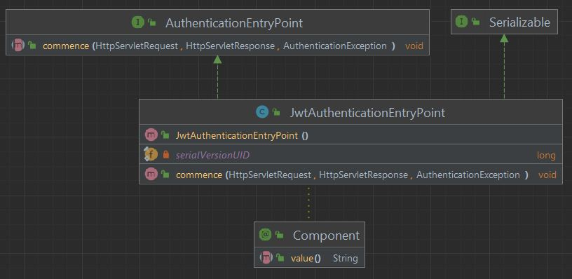

21. Criar classe `JwtAuthenticationTokenFilter`:
- extends `OncePerRequestFilter`;
- tem atributos das classes `UserDetailsService` e `JwtTokenUtil`.
- anotada com `@Component`. 

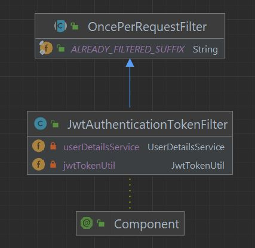

22. Adicionar classe `WebSecurityConfiguration`:
- com atributos das classes `JwtAuthenticationEntryPoint`, `UserDetailsService`, `JwtAuthenticationTokenFilter`;
- tem o métodos `protected SecurityFilterChain filterChain(HttpSecurity http)` e `public PasswordEncoder encoder()`.
- anotada com `@Configuration` e `@EnableWebSecurity`.
  
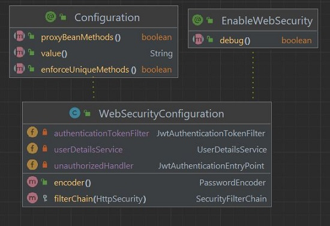

23. Adicionar classe `JwtAuthenticationRequest`:
- com atributos `private static final long serialVersionUID = 1L`, `private String email`, `private String password`;
- com o construtor padrão e construtor com parâmetros `String email`, `String password`.

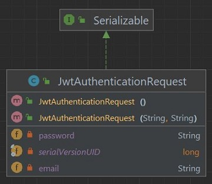

24. Adicionar classe `CurrentUser`:
- no pacote `api.security.models`;
- com atributos `private String token`, `private User user`;
- com o construtor padrão e construtor com parâmetros `String token`, `User user`.

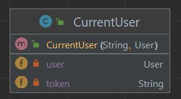

25. Adicionar classe `AuthenticationRestController`:
- no pacote `api.security.controllers`;
- com atributos  das classes `AuthenticationManager`, `JwtTokenUtil`, `UserDetailsService`, `UserService`;
- com o construtor com todos os atributos como parâmetros;
- anotada com `@RestController` e `@CrossOrigin(origins = "*")`.

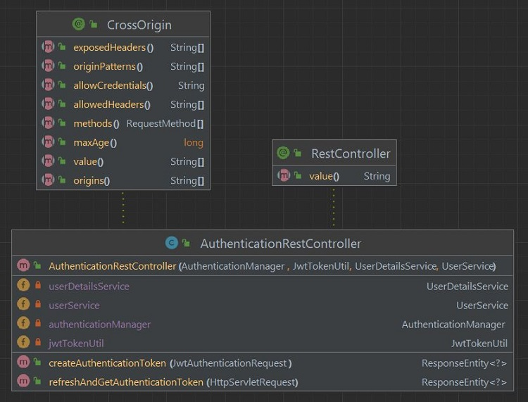

26. Alterar classe `UdemyJavaSpringHelpDeskApplication`:
- adicionar método `void initUsers(UserRepository userRepository, PasswordEncoder passwordEncoder)`;
- adicionar método `CommandLineRunner init(UserRepository userRepository, PasswordEncoder passwordEncoder)` anotado com `@Bean`.

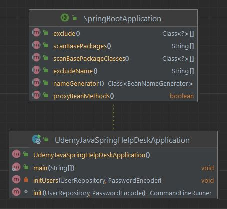

27. Adicionar classe `SimpleCORSFilter`:
- no pacote `api.security.filters`;
- implementa `Filter`;
- com atributo `private final Log logger = LogFactory.getLog(this.getClass())`;
- anotada com `@@Component` e `@Order(Ordered.HIGHEST_PRECEDENCE)`.

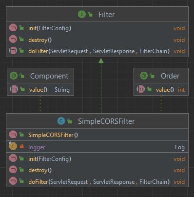


## Referências
Udemy - Angular 5, JWT, Spring Boot,REST,Security,Data e MongoDB - Francis Klay Rocha:
https://www.udemy.com/course/angular-5-jwt-spring-rest/

MVN Repository - JJWT :: API » 0.12.3:
https://mvnrepository.com/artifact/io.jsonwebtoken/jjwt-api/0.12.3

MVN Repository - JJWT :: Impl » 0.12.3:
https://mvnrepository.com/artifact/io.jsonwebtoken/jjwt-impl/0.12.3

MVN Repository - JJWT :: Extensions :: Jackson » 0.12.3
https://mvnrepository.com/artifact/io.jsonwebtoken/jjwt-jackson/0.12.3

Stack Overflow - Question 72381114:
https://stackoverflow.com/questions/72381114/spring-security-upgrading-the-deprecated-websecurityconfigureradapter-in-spring

Alura - Fórum - 228994:
https://cursos.alura.com.br/forum/topico-springboot-2-7-injetar-authenticationmanager-sem-o-websecurityconfigureradapter-228994

GitHub -  klayrocha - angular-spring-api:
https://github.com/klayrocha/angular-spring-api/tree/master

Java Doc - io.jsonwebtoken - jjwt-api - 0.12.3:
https://javadoc.io/doc/io.jsonwebtoken/jjwt-api/latest/deprecated-list.html

Apps developer blog - Add and validate custom claims in jwt
https://www.appsdeveloperblog.com/add-and-validate-custom-claims-in-jwt/