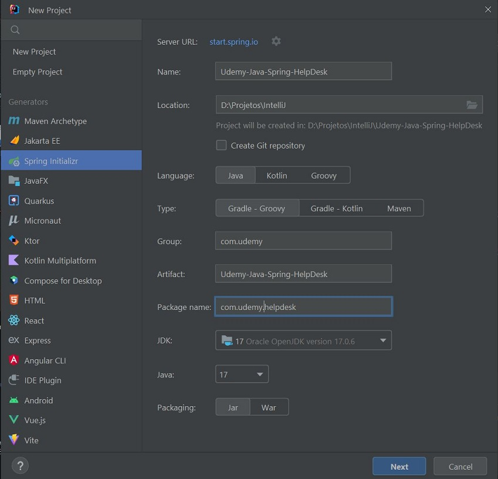
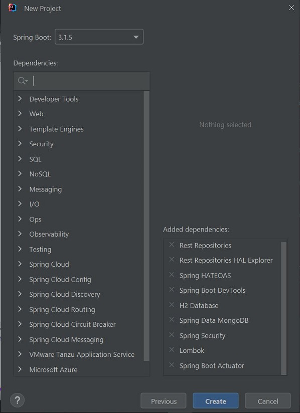

# Udemy - Help Desk - Back-end with Spring

## Project Starter





## MongoDB
- Download MongoDB Community Server: https://www.mongodb.com/try/download/community
- Install MongoDB Community Server with MongoDB Compass.
- Run MongoDB Compass and connect:


## Steps
1. Install JDK, IDE (IntelliJ) and MongoDB.
2. Create project with the specifications shown previously.
3. Add MongoDB to the project:
- Add dependency `implementation 'org.springframework.boot:spring-boot-starter-data-mongodb'` in `build.grade`.
- Configure `application.properties`:
```properties
# management.health.mongo.enabled=false
spring.data.mongodb.host=localhost
spring.data.mongodb.port=27017
spring.data.mongodb.database=local
```
4. Add validator:
- Add the dependency `implementation group: 'javax.validation', name: 'validation-api', version: '2.0.1.Final'` in `build.grade`.


## References
Udemy - Angular 5, JWT, Spring Boot,REST,Security,Data e MongoDB - Francis Klay Rocha:
https://www.udemy.com/course/angular-5-jwt-spring-rest/